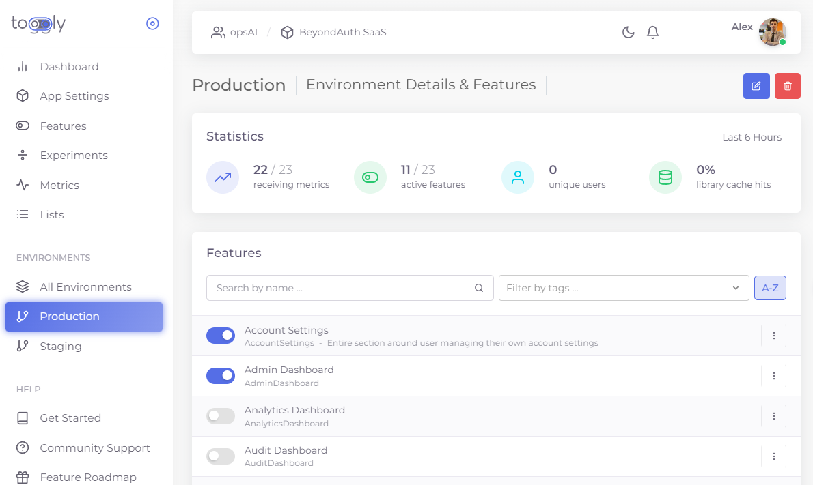

  

Enables teams to release software faster and safer, and with better results. Focus on what's most important, release at a time of your choosing. 

Toggly is a feature flags service that lets you quickly turn features on/off or rollout to a subset of users without having to redeploy your app, view metrics on feature usage, and run experiments to see how a feature affects your business metrics.

Get started in 5 minutes with our Always Free, Forever! Plan at https://toggly.io

  

# Choose Your Environment

[.NET](tree/develop/Toggly.FeatureManagement.NET)
[Flutter](tree/develop/Toggly.FeatureManagement.Flutter/toggly)
[Javascript](tree/develop/Toggly.FeatureManagement.Javascript/feature_flags_toggly)
[HTML/CSS](tree/develop/Toggly.FeatureManagement.Css)

## Find out more about Toggly.io

Visit [our official website](https://toggly.io) or [check out a video overview and our docs](https://docs.toggly.io/).
