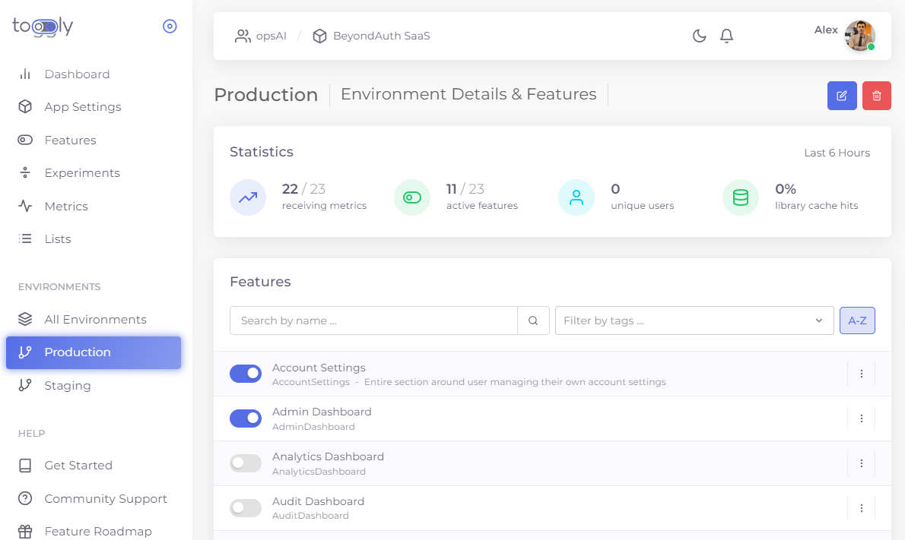

  

<h1 align="center">Toggly Feature Management SDKs</h1>

  Official client libraries for <a href="https://toggly.io">Toggly</a> — feature flags, progressive delivery, usage metrics, and experiments.

  
  
  
  

## What's in this repository

This monorepo contains the **official Toggly SDKs** across web, mobile, and backend platforms. Use them to evaluate feature flags remotely, target rollouts, and integrate with the Toggly platform — many packages can also be used for local / offline evaluation patterns.

- Turn features on or off without redeploying
- Roll out to a subset of users with targeting rules
- Measure feature usage and run experiments
- Ship with idiomatic APIs for each framework

## Get started

1. Create a free app at [toggly.io](https://toggly.io) (Always Free plan available).
2. Follow the guides at [docs.toggly.io](https://docs.toggly.io).
3. Pick your SDK from the catalog below.

> Install and usage details live in each package README and in the docs. This root page is the index.

## SDKs

### Web & frontend

| Platform | Package | Path | Docs |
|----------|---------|------|------|
| JavaScript / TypeScript | `@ops-ai/feature-flags-toggly` | [`Toggly.FeatureManagement.Javascript/feature_flags_toggly`](Toggly.FeatureManagement.Javascript/feature_flags_toggly) | [Docs](https://docs.toggly.io) |
| React | `@ops-ai/react-feature-flags-toggly` | [`Toggly.FeatureManagement.React`](Toggly.FeatureManagement.React) | [Docs](https://docs.toggly.io) |
| Angular | `@ops-ai/ngx-feature-flags-toggly` | [`Toggly.FeatureManagement.Angular`](Toggly.FeatureManagement.Angular) | [Docs](https://docs.toggly.io) |
| Vue | `@ops-ai/vue-feature-flags-toggly` | [`Toggly.FeatureManagement.Vue`](Toggly.FeatureManagement.Vue) | [Docs](https://docs.toggly.io) |
| Svelte | `@ops-ai/svelte-feature-flags-toggly` | [`Toggly.FeatureManagement.Svelte`](Toggly.FeatureManagement.Svelte) | [Docs](https://docs.toggly.io) |
| Astro | `@ops-ai/astro-feature-flags-toggly` | [`Toggly.FeatureManagement.Astro`](Toggly.FeatureManagement.Astro) | [Docs](https://docs.toggly.io) |
| Gatsby | `@ops-ai/gatsby-feature-flags-toggly` | [`Toggly.FeatureManagement.Gatsby`](Toggly.FeatureManagement.Gatsby) | [Docs](https://docs.toggly.io) |
| Next.js | `@ops-ai/nextjs-toggly-*` | [`Toggly.FeatureManagement.Next`](Toggly.FeatureManagement.Next) | [Docs](https://docs.toggly.io) |
| Nuxt | `@ops-ai/nuxt-toggly-*` | [`Toggly.FeatureManagement.Nuxt`](Toggly.FeatureManagement.Nuxt) | [Docs](https://docs.toggly.io) |
| Remix | `@ops-ai/remix-toggly-*` | [`Toggly.FeatureManagement.Remix`](Toggly.FeatureManagement.Remix) | [Docs](https://docs.toggly.io) |
| HTML / CSS | CSS helpers | [`Toggly.FeatureManagement.Css`](Toggly.FeatureManagement.Css) | [Docs](https://docs.toggly.io) |
| WordPress | WordPress plugin | [`Toggly.FeatureManagement.Wordpress`](Toggly.FeatureManagement.Wordpress) | [Docs](https://docs.toggly.io) |

### Mobile

| Platform | Package | Path | Docs |
|----------|---------|------|------|
| Flutter | `feature_flags_toggly` (+ storage packages) | [`Toggly.FeatureManagement.Flutter`](Toggly.FeatureManagement.Flutter) | [Docs](https://docs.toggly.io) |
| React Native | `@ops-ai/react-native-toggly*` | [`Toggly.FeatureManagement.ReactNative`](Toggly.FeatureManagement.ReactNative) | [Docs](https://docs.toggly.io) |
| Android | `io.toggly:toggly-android-*` | [`Toggly.FeatureManagement.Android`](Toggly.FeatureManagement.Android) | [Docs](https://docs.toggly.io) |
| iOS | Swift Package `Toggly` | [`Toggly.FeatureManagement.iOS`](Toggly.FeatureManagement.iOS) | [Docs](https://docs.toggly.io) |

### Backend & servers

| Platform | Package | Path | Docs |
|----------|---------|------|------|
| .NET | `Toggly.FeatureManagement` (+ Hangfire, storage, NSwag, …) | [`Toggly.FeatureManagement.NET`](Toggly.FeatureManagement.NET) | [Docs](https://docs.toggly.io) |
| Node.js | `@ops-ai/toggly-node-core`, Express / Fastify / Hono / Koa | [`Toggly.FeatureManagement.Node`](Toggly.FeatureManagement.Node) | [Docs](https://docs.toggly.io) |
| Python | `toggly` (+ cache / framework packages) | [`Toggly.FeatureManagement.Python`](Toggly.FeatureManagement.Python) | [Docs](https://docs.toggly.io) |
| Java | `io.toggly:toggly-*` | [`Toggly.FeatureManagement.Java`](Toggly.FeatureManagement.Java) | [Docs](https://docs.toggly.io) |
| PHP | [`toggly/feature-management-php`](https://packagist.org/packages/toggly/feature-management-php) | [`ops-ai/Toggly.FeatureManagement.PHP`](https://github.com/ops-ai/Toggly.FeatureManagement.PHP) | [Docs](https://docs.toggly.io) · [Packagist](https://packagist.org/packages/toggly/feature-management-php) |
| Go | [`github.com/ops-ai/Toggly.FeatureManagement/toggly-go`](https://pkg.go.dev/github.com/ops-ai/Toggly.FeatureManagement/toggly-go) | [`toggly-go`](toggly-go) | [Docs](https://docs.toggly.io) · [pkg.go.dev](https://pkg.go.dev/github.com/ops-ai/Toggly.FeatureManagement/toggly-go) |
| Ruby | `toggly`, `toggly-rails`, `toggly-cache` | [`toggly-ruby`](toggly-ruby) | [Docs](https://docs.toggly.io) |
| Rust | `toggly` (+ axum / actix / rocket) | [`toggly-rust`](toggly-rust) | [Docs](https://docs.toggly.io) |

### Integrations & hooks

| Integration | Package | Path | Docs |
|-------------|---------|------|------|
| Google Analytics 4 | `@ops-ai/toggly-ga4-hook` | [`toggly-ga4-hook`](toggly-ga4-hook) | [Docs](https://docs.toggly.io) |
| Microsoft Clarity | `@ops-ai/toggly-clarity-hook` | [`toggly-clarity-hook`](toggly-clarity-hook) | [Docs](https://docs.toggly.io) |
| Application Insights | `@ops-ai/toggly-appinsights-hook` | [`toggly-appinsights-hook`](toggly-appinsights-hook) | [Docs](https://docs.toggly.io) |
| Hook types | `@ops-ai/toggly-hooks-types` | [`toggly-hooks-types`](toggly-hooks-types) | [Docs](https://docs.toggly.io) |
| Docusaurus / edge | `@ops-ai/toggly-docusaurus-plugin`, Cloudflare helpers | [`toggly-docusaurus-edge-sdk`](toggly-docusaurus-edge-sdk) | [Docs](https://docs.toggly.io) |
| Local gates | `@ops-ai/toggly-local-gates` | [`toggly-local-gates`](toggly-local-gates) | [Docs](https://docs.toggly.io) |

### Tools

| Tool | Path | Docs |
|------|------|------|
| Toggly CLI | [`Toggly.CLI`](Toggly.CLI) | [Docs](https://docs.toggly.io) · [Releases](https://github.com/ops-ai/Toggly.FeatureManagement/releases) |

## Documentation & resources

- **Product docs**: [docs.toggly.io](https://docs.toggly.io)
- **Website**: [toggly.io](https://toggly.io)
- **SDK releases**: [`.github/RELEASE.md`](.github/RELEASE.md)

  

## Contributing

Please **open an issue first** for bugs and feature ideas, then follow [`CONTRIBUTING.md`](CONTRIBUTING.md). Large PRs without prior discussion may be closed.

## Security

Report vulnerabilities privately via [GitHub Private Vulnerability Reporting](https://github.com/ops-ai/Toggly.FeatureManagement/security/advisories/new). See [`SECURITY.md`](SECURITY.md). Do not file public issues for security reports.

## License

Most packages in this repository are licensed under the [MIT License](LICENSE). WordPress plugin packaging follows [GPLv2 or later](Toggly.FeatureManagement.Wordpress/readme.txt) as required by the WordPress ecosystem.

## Support

- Guides and API references: [docs.toggly.io](https://docs.toggly.io)
- Bugs and features: [GitHub Issues](https://github.com/ops-ai/Toggly.FeatureManagement/issues/new/choose) (structured templates)
- Code of conduct: [`CODE_OF_CONDUCT.md`](CODE_OF_CONDUCT.md)
