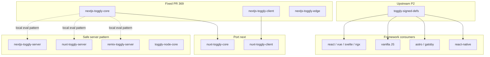

# SDK fleet audit — identity safety & error-envelope gaps

**Linear**: [OPS-897](https://linear.app/opsai/issue/OPS-897/sdk-fleet-audit-identity-safety-and-error-envelope-gaps-ops-828831)  
**Origin**: [OPS-828](https://linear.app/opsai/issue/OPS-828) / [OPS-831](https://linear.app/opsai/issue/OPS-831) (Next.js PR [#369](https://github.com/ops-ai/Toggly.FeatureManagement/pull/369))  
**Repo**: `ops-ai/Toggly.FeatureManagement`  
**Date**: 2026-09-04

## Purpose

After fixing Next.js client/core/edge identity leaks, audit **every publishable SDK** for the same failure-semantics family. This doc is the fleet inventory, severity matrix, and remediation order.

## Pattern definitions

| ID | Pattern | Example failure |
|----|---------|-----------------|
| **P1** | `setIdentity` / `setContext` commits new identity/context before a successful refresh; no withhold of prior enables; no restore on failure | User A’s gated flags still enabled while UI shows identity B |
| **P2** | HTTP 2xx body with `{ "error": "…" }` (or other unsupported shape) treated as successful definitions | Empty `{}` clears error; negated/off gates open incorrectly |
| **P3** | Shared singleton client; per-request code mutates `client.identity` (or equivalent) | Concurrent edge/middleware requests leak targeting |
| **P4** | Shared client caches **evaluated-signed** booleans (identity-scoped fetch) instead of **definitions-signed + per-request eval** | Identity B served identity A’s cached booleans within TTL |
| **P5** | Persisted last-known-good flags merged into defaults but **not** seeded into provider/UI reactive state | Outage: confirmed-off flags stay withheld in hooks |

**Status legend:** `fixed` · `vulnerable` · `partial` · `n/a`  
**Severity:** `critical` · `high` · `medium` · `low` · `n/a`

---

## Executive summary

| Tier | Packages | Action |
|------|----------|--------|
| **Fixed (PR #369 branch)** | `nextjs-toggly-core`, `nextjs-toggly-client`, `nextjs-toggly-edge` | Merge PR #369 |
| **High — copy-paste port** | `nuxt-toggly-core`, `nuxt-toggly-client` | Port Next core/client fixes |
| **High — upstream P2** | `toggly-signed-defs` | Add error-envelope validation once; fixes React/Vue/Svelte/Angular/JS/Astro/Gatsby/RN consumers |
| **High — framework clients** | React, Vue, Svelte, Angular, Remix client, Astro, Gatsby, vanilla JS, React Native | Withhold/restore + envelope hardening (or migrate to shared core) |
| **Safe (server-side local eval)** | Next/Nuxt/Remix server, Node core + Express/Fastify/Hono/Koa, .NET, Go, Ruby | P3/P4 already correct by architecture |
| **Different model — spot check** | Python (local eval), Flutter (withhold + per-user cache), mobile native | Lower P1 risk; P2 parity still worth hardening |

---

## Summary matrix (consumer-facing)

| Package | P1 | P2 | P3 | P4 | P5 | Top severity |
|---------|----|----|----|----|-----|--------------|
| **nextjs-toggly-core** | fixed† | fixed† | partial | partial‡ | n/a | high |
| **nextjs-toggly-client** | fixed† | fixed† | fixed | partial‡ | fixed† | medium |
| **nextjs-toggly-edge** | n/a | partial | partial | fixed† | n/a | medium |
| **nextjs-toggly-server** | n/a | n/a | fixed | fixed | n/a | none |
| **nuxt-toggly-core** | **vuln** | **vuln** | partial | partial‡ | n/a | **high** |
| **nuxt-toggly-client** | **vuln** | **vuln** | **vuln** | partial‡ | fixed | **high** |
| **nuxt-toggly-server** | n/a | n/a | fixed | fixed | n/a | none |
| **toggly-node-core** + Express/Fastify/Hono/Koa | n/a | n/a | fixed | fixed | n/a | none |
| **react / vue / svelte / ngx** | **vuln** | **vuln** | partial | **vuln** | fixed | **high** |
| **feature-flags-toggly** (vanilla JS) | **vuln** | **vuln** | **vuln** | **vuln** | partial | **critical** |
| **astro / gatsby** | **vuln** | **vuln** | **vuln** | **vuln** | n/a | **high** |
| **react-native** (+ core) | **vuln** | **vuln** | partial | **vuln** | partial | **high** |
| **remix-toggly-server** | n/a | n/a | fixed | fixed | n/a | none |
| **remix-toggly-client** | **vuln** | **vuln** | partial | **vuln** | partial | **high** |
| **toggly-signed-defs** | n/a | **vuln** | n/a | n/a | n/a | **critical** (upstream) |
| **toggly-docusaurus-edge-sdk** | n/a | **vuln** | n/a | **vuln** | n/a | medium |
| **Toggly.FeatureManagement (.NET)** | n/a | partial | partial | n/a | fixed | low |
| **toggly (Python)** | low | partial | n/a | n/a | fixed | low |
| **toggly (Flutter)** | partial | partial | n/a | **vuln** | fixed | medium |
| **toggly-go / toggly-ruby** | n/a | partial | n/a | n/a | fixed | low |

† Fixed on PR #369 branch; **`develop` still vulnerable** until merge.  
‡ Remote rail uses evaluated-signed; local rail is safe. SSR shared-client risk remains on remote mode.

---

## Detailed findings

### Next.js — fixed in PR #369

| Package | Finding |
|---------|---------|
| `nextjs-toggly-core` | `parse-evaluated-payload.ts` rejects error envelopes; `setIdentity`/`setContext` withhold → refresh → restore; `refresh()` rethrows |
| `nextjs-toggly-client` | Provider publishes identity/persist only after core success; persisted LKG seeds React `features` |
| `nextjs-toggly-edge` | `definitions-signed` + `buildEdgeEvalOverrides`; middleware no longer assigns `client.identity` |
| `nextjs-toggly-server` | Already on local eval + ambient request context — reference architecture |

**Residual (edge):** P2 envelope guard not yet on definitions parse path; `client.identity` setter still exists (documented, not no-op’d).

---

### Nuxt — highest port priority

Near-copy of **pre-fix** Next core.

| Pattern | Evidence |
|---------|----------|
| P1 | `nuxt-toggly-core/src/client.ts:753-770` — `config.identity = identity` then `await client.refresh()` with no withhold/restore |
| P2 | `nuxt-toggly-core/src/client.ts:354-388` — inline parse; `{ error: "boom" }` → `{}` |
| P3 | `nuxt-toggly-client/src/composables/useToggly.ts:12-13` — module `globalClient` singleton |
| P5 | **Fixed** — `useToggly.ts:62` seeds `features.value` from localStorage |

**Fix:** Port PR #369 core + client changes verbatim (adjust package names).

---

### Node server family — safe

| Package | Architecture |
|---------|--------------|
| `toggly-node-core` | `definitions-signed` fetch; `isFeatureOn(key, context, …)` evaluates per call |
| `toggly-express` / `fastify` / `hono` / `koa` | Singleton client; middleware passes per-request context into `isFeatureOn` |

No P1/P3/P4 on typical multi-tenant server usage.

---

### React / Vue / Svelte / Angular — shared evaluated-signed client

All use `fetchEvaluatedSignedDefinitions` from `@ops-ai/toggly-signed-defs` and the same `setContext` flow.

| Pattern | Evidence (React; others mirror) |
|---------|--------------------------------|
| P1 | `React/src/services/toggly.service.ts:506-518` — mutates identity, clears `_features`, loads; no restore on catch |
| P2 | `(parsedDefs ?? {})` + `asVariantDefsRecord` → `{}` for bad shapes (`toggly-signed-defs/src/signed-response.ts:275-290`) |
| P4 | Context-scoped cache key + `evaluated-signed` URL |
| P5 | **Fixed** — constructor seeds `_features` from localStorage (`:399-420`) |

**Fix options:**

1. **Upstream:** Harden `toggly-signed-defs` (P2 for all four).
2. **Per package:** Withhold `_features` to defaults before load; restore identity + features on failure (mirror OPS-828).
3. **Strategic:** Migrate browser SDKs onto shared core with local eval + server hydration (longer term).

---

### Vanilla JS (`feature-flags-toggly`) — worst browser surface

| Pattern | Evidence |
|---------|----------|
| P1 | `lib/toggly.ts:346-362` — `setContext` mutates identity then `refresh()` |
| P2 | `lib/toggly.ts:636-637` — error body coerced to `{}` and cached |
| P3 | Static class singleton (`lib/toggly.ts:47-67`) |
| P4 | `evaluated-signed` + identity-scoped cache |

**Severity: critical** for any multi-tenant or identity-switching SPA still on the legacy bundle.

---

### Astro / Gatsby — module singleton stores

Same evaluated-signed singleton pattern as vanilla JS.

| Pattern | Evidence |
|---------|----------|
| P1 | `Astro/src/client/store.ts:604-607` — `setIdentity` + fire-and-forget `refresh()` |
| P2 | `unwrapDefsPayload` with no envelope check |
| P3 | Module singleton `clientInstance` |
| P4 | `evaluated-signed` fetch |

Gatsby `src/client/store.ts` mirrors Astro.

---

### React Native

| Pattern | Evidence |
|---------|----------|
| P1 | `libs/core/src/services/TogglyService.ts:812-846` — identity committed, cache cleared, `refresh()`; no feature restore on failure |
| P2 | Evaluated-signed fetch; no envelope guard |
| P4 | Identity-scoped storage cache key |
| P5 | partial — service cache exists; provider has no separate `features` state |

---

### Remix

| Package | Status |
|---------|--------|
| `remix-toggly-server` | **Fixed** — local eval + eval-context store (same as Next server) |
| `remix-toggly-client` | **Vulnerable** — `context.tsx:354-357` sets identity before `fetchFlags`; payload cast to `FeatureFlags` or `{}` |

**Fix:** Align client with server rail (definitions + local eval) or port withhold/restore.

---

### Shared libraries

| Package | Finding |
|---------|---------|
| **`toggly-signed-defs`** | **P2 critical upstream** — `unwrapDefsPayload` / `asVariantDefsRecord` do not reject `{ error: … }`. Every consumer listed above inherits this. |
| `toggly-eval`, `toggly-hooks-types`, `toggly-local-gates` | n/a — pure eval/types |
| Analytics hooks (GA4, Clarity, App Insights) | n/a |

---

### Docusaurus edge SDK

| Surface | Finding |
|---------|---------|
| Build-time plugin | Uses signed-defs helpers — P2 inherited |
| Cloudflare `_middleware.ts` | `evaluated-signed`; returns `{}` on failure — P2 + P4 |

Low runtime identity switching; medium severity for incorrect build-time flags.

---

### .NET (`Toggly.FeatureManagement`)

**Architecture differs** — not affected by P1/P4 as implemented today.

| Pattern | Status | Notes |
|---------|--------|-------|
| P1 | n/a | No `setIdentity`; per-request `ITargetingContextAccessor` |
| P2 | partial | Signed path requires `defs` + valid signature; no explicit `{ error }` rejection |
| P3 | partial | `HttpClient.DefaultRequestHeaders` mutated on refresh (UserAgent accumulation, If-None-Match race) — not identity bleed |
| P4 | n/a | Definitions-signed singleton + filter evaluation |
| P5 | fixed | `LoadSnapshot` → `ApplyNewDefinitions` → `UpdateFeatureState` |

Storage providers (DistributedCache, RavenDB, MongoDB, Dapper, EF) delegate to core — same P5 status.

**Optional hardening:** explicit error-envelope check in `TogglyFeatureProvider.FetchAndApplyDefinitionsAsync`; per-request `HttpRequestMessage` headers instead of mutating pooled client defaults.

---

### Python (`Toggly.FeatureManagement.Python/toggly`)

| Pattern | Status | Notes |
|---------|--------|-------|
| P1 | low | `set_identity` then `refresh`, but `is_enabled` re-evaluates from `_definitions` with current identity via engine — not remote-eval cache leak |
| P2 | partial | Definitions fetch; no explicit error envelope test |
| P4 | n/a | Definitions-signed + local engine |

---

### Flutter (`Toggly.FeatureManagement.Flutter/toggly`)

| Pattern | Status | Notes |
|---------|--------|-------|
| P1 | partial | **Better than JS** — `_clearInMemoryEvaluationState()` + emit defaults before refresh (`toggly.dart:328-330`) |
| P2 | partial | `parseEvaluatedDefinitions` coerces unknown keys to `false`; does not throw on `{ error: "boom" }` |
| P4 | vulnerable | Uses `evaluated-signed`; per-identity persisted cache (by design for mobile switch-back) |
| P5 | fixed | Multi-user persisted cache + stream seeding |

---

### Go / Ruby

| Pattern | Status |
|---------|--------|
| P4 | n/a — `definitions-signed` provider pattern |
| P2 | partial — standard HTTP success checks; no envelope-specific tests found |

---

## Code-path lineage

---

## Recommended remediation order

### Phase 0 — Ship known fix

1. Merge [PR #369](https://github.com/ops-ai/Toggly.FeatureManagement/pull/369) to `develop`.
2. Publish `@ops-ai/nextjs-toggly-core@1.8.2`, `@ops-ai/nextjs-toggly-client@1.4.1`, `@ops-ai/nextjs-toggly-edge@1.3.0`.

### Phase 1 — Highest ROI (1–2 PRs)

1. **Port Next core fixes → `nuxt-toggly-core`** (P1, P2, `setContext`, `refresh()` rethrow).
2. **Port Next client fixes → `nuxt-toggly-client`** (P1 provider discipline; already has P5).
3. **Harden `toggly-signed-defs`** — add `rejectErrorEnvelope()` used by `unwrapDefsPayload` / fetch helpers; unit tests mirroring `parse-evaluated-payload.test.ts`.

### Phase 2 — Framework browser SDKs (batched or per-package)

4. React / Vue / Svelte / Angular — withhold/restore in `setContext`; consume hardened signed-defs.
5. Remix client — server-rail alignment or withhold/restore.
6. Astro / Gatsby / vanilla JS — same, or deprecation path to framework packages.

### Phase 3 — Mobile & edge adjuncts

7. React Native — withhold/restore in `TogglyService.setIdentity`.
8. Docusaurus edge middleware — definitions-signed or envelope guard.
9. Flutter — explicit error-envelope throw (P2 parity).

### Phase 4 — .NET / Python parity (optional)

10. .NET explicit envelope rejection + HttpRequestMessage-scoped headers.
11. Python envelope tests (already structurally safer).

---

## Test checklist (per fix)

Use this when closing gaps on any package:

- [ ] Identity A enabled → `setIdentity(B)` with failing refresh → identity stays A (or B with defaults only), A’s enables not visible for B
- [ ] HTTP 200 `{ "error": "boom" }` → `state.error` set, no success notification, prior flags unchanged on refresh failure
- [ ] Concurrent middleware identities → singleton identity unchanged; evaluations differ by override
- [ ] Definitions fetch URL has no `?u=` when on local rail
- [ ] Persisted LKG flags visible in provider/hook state before successful network fetch

---

## Tracking

| Work | Linear |
|------|--------|
| Fleet audit (this doc) | [OPS-897](https://linear.app/opsai/issue/OPS-897) |
| Next.js client fixes | [OPS-828](https://linear.app/opsai/issue/OPS-828) |
| Next.js edge fixes | [OPS-831](https://linear.app/opsai/issue/OPS-831) |
| Nuxt port | TBD — child of OPS-897 |
| toggly-signed-defs hardening | TBD — child of OPS-897 |
| Framework client parity | TBD — child of OPS-897 |

---

## References

- Plan: `.cursor/plans/ops-828_ops-831_plan_c4e5783a.plan.md`
- Oracle Round 9 findings (OPS-819 review, out-of-slice)
- Safe reference implementations: `nextjs-toggly-server`, `nuxt-toggly-server`, `remix-toggly-server`, `toggly-node-core`, .NET `TogglyTargetingFilter`
