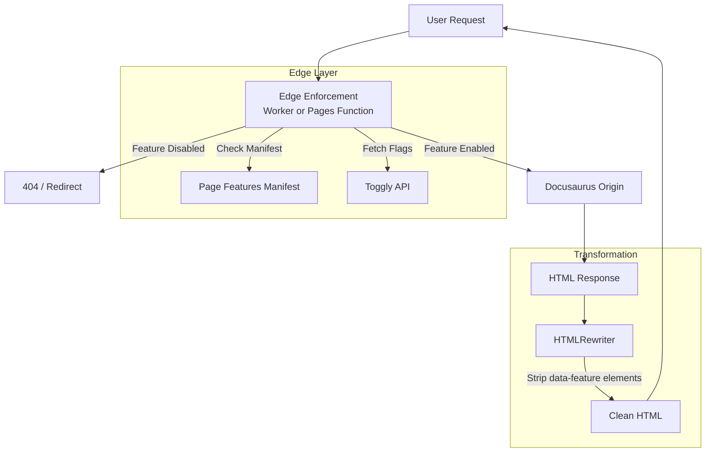

# Toggly Docusaurus Edge SDK

A comprehensive solution for gating Docusaurus documentation content with Toggly feature flags, combining client-side React components with edge-level enforcement via Cloudflare Workers.

## Overview

This project solves the problem of "leaky" feature flags in documentation sites. Standard client-side gating hides content from the UI but leaves it accessible in the source code or via direct URL access.

This solution provides:

1.  **True Edge Enforcement**: A Cloudflare Worker intercepts requests and returns 404s or redirects for disabled feature pages *before* the content reaches the browser.
2.  **Developer Experience**: A Docusaurus plugin that makes gating as simple as adding `x-feature: my_feature` to your Markdown frontmatter.
3.  **Granular Control**: Gate entire pages or specific sections within a page using React components or data attributes.

## Architecture



### Components

-   **`@ops-ai/toggly-client-core`**: Framework-agnostic Toggly client for feature flag evaluation. Used by all the runtime variants below.
-   **`@ops-ai/toggly-docusaurus-plugin`**:
    -   Extracts `x-feature` frontmatter during build.
    -   Generates `toggly-page-features.json` manifest for the edge runtime.
    -   Injects configuration into the client bundle.
    -   Provides `<Feature>` components and hooks for the UI.
-   **Edge enforcement** (pick one — both ship in this SDK):
    -   [`cloudflare/pages-function`](./cloudflare/pages-function/README.md) — drop-in
        `_middleware.ts` for sites already deployed on Cloudflare Pages.
        Single file, single dep (`@ops-ai/toggly-client-core`), no separate
        deploy step, no Cloudflare Access service-token to manage. **Recommended
        when your DNS already points at Pages.**
    -   [`cloudflare/worker`](./cloudflare/worker/README.md) — standalone Cloudflare
        Worker that fronts any HTML origin (Pages, GitHub Pages, Netlify, Vercel,
        S3+CDN, your own server). Use this when your Docusaurus site is **not**
        on Cloudflare Pages, or when you want the edge transform to live as a
        separate deploy from the static site.

Both runtimes do the same three things — read the manifest, fetch the flag map
from Toggly, and run `HTMLRewriter` to strip disabled `[data-feature]` blocks
and inject the hydration-safe `window.__TOGGLY_EDGE_FLAGS__` snapshot.

## Quickstart

### 1. Install the Plugin

In your Docusaurus project:

```bash
npm install @ops-ai/toggly-docusaurus-plugin @ops-ai/toggly-client-core
```

### 2. Configure Docusaurus

Add the plugin to `docusaurus.config.js`:

```javascript
module.exports = {
  plugins: [
    [
      '@ops-ai/toggly-docusaurus-plugin',
      {
        baseURI: 'https://definitions.toggly.io',
        appKey: 'YOUR_APP_KEY',
        environment: 'Production',
      },
    ],
  ],
};
```

### 3. Gate a Page

Add `x-feature` to the frontmatter of any doc:

```markdown
---
title: Enterprise SSO
x-feature: enterprise_sso
---

This page is only visible if `enterprise_sso` is enabled.
```

### 4. Gate a Section

Wrap content in your MDX files:

```jsx
import { Feature } from '@ops-ai/toggly-docusaurus-plugin/client';

<Feature flag="beta_filters">
  ## Advanced Filters
  This section is only visible if `beta_filters` is enabled.
</Feature>
```

### 5. Enforce gating at the edge

Pick the install path that matches your hosting setup:

#### A) On Cloudflare Pages → use the Pages Function

If your Docusaurus site is already deployed on Cloudflare Pages, copy
`cloudflare/pages-function/functions/_middleware.ts` into your project as
`functions/_middleware.ts`, install one runtime dep, and set three env vars on
the Pages project. No second deploy, no separate domain, no Access token.

```bash
# In your Docusaurus project
npm install @ops-ai/toggly-client-core
mkdir -p functions
curl -o functions/_middleware.ts \
  https://raw.githubusercontent.com/ops-ai/Toggly.FeatureManagement/main/toggly-docusaurus-edge-sdk/cloudflare/pages-function/functions/_middleware.ts
git add functions package.json package-lock.json
git commit -m "Add Toggly edge middleware"
git push
```

Then in the Cloudflare dashboard → your Pages project → **Settings** →
**Environment variables**, add:

| Variable | Value |
|---|---|
| `TOGGLY_API_BASE_URL` | `https://definitions.toggly.io` |
| `TOGGLY_ENVIRONMENT` | `Production` |
| `TOGGLY_APP_KEY` | Your Frontend app key (mark as Secret) |

Full instructions and config options:
[`cloudflare/pages-function/README.md`](./cloudflare/pages-function/README.md).

#### B) Anywhere else → use the standalone Worker

If your site is on GitHub Pages, Netlify, Vercel, S3+CloudFront, your own
server, or anywhere other than Cloudflare Pages, deploy the standalone
Cloudflare Worker in front of it. The Worker fetches HTML from your
existing origin and applies the same gating logic.

Full instructions: [`cloudflare/worker/README.md`](./cloudflare/worker/README.md).

## Development

This monorepo uses pnpm workspaces.

```bash
# Install dependencies
pnpm install

# Build all packages
pnpm build

# Run tests
pnpm test
```

## Project Structure

-   `libs/core`: Framework-agnostic Toggly client (`@ops-ai/toggly-client-core`).
-   `libs/docusaurus-plugin`: Build-time plugin + React runtime
    (`@ops-ai/toggly-docusaurus-plugin`).
-   `cloudflare/pages-function`: Drop-in Pages Functions middleware (`_middleware.ts`).
-   `cloudflare/worker`: Standalone Cloudflare Worker for non-Pages origins.

## License

MIT
