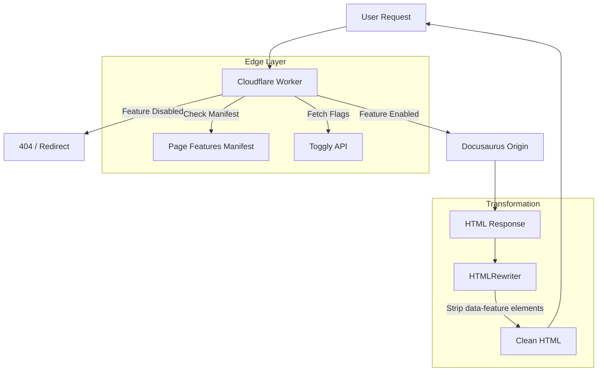

# Toggly Docusaurus Edge SDK

A comprehensive solution for gating Docusaurus documentation content with Toggly feature flags, combining client-side React components with edge-level enforcement via Cloudflare Workers.

## Overview

This project solves the problem of "leaky" feature flags in documentation sites. Standard client-side gating hides content from the UI but leaves it accessible in the source code or via direct URL access.

This solution provides:

1.  **True Edge Enforcement**: A Cloudflare Worker intercepts requests and returns 404s or redirects for disabled feature pages *before* the content reaches the browser.
2.  **Developer Experience**: A Docusaurus plugin that makes gating as simple as adding `x-feature: my_feature` to your Markdown frontmatter.
3.  **Granular Control**: Gate entire pages or specific sections within a page using React components or data attributes.

## Architecture



### Components

-   **`@ops-ai/toggly-client-core`**: Framework-agnostic Toggly client for feature flag evaluation.
-   **`@ops-ai/toggly-docusaurus-plugin`**:
    -   Extracts `x-feature` frontmatter during build.
    -   Generates `toggly-page-features.json` manifest for the Worker.
    -   Injects configuration into the client bundle.
    -   Provides `<Feature>` components and hooks for the UI.
-   **`@ops-ai/toggly-cloudflare-worker`**:
    -   Reads the manifest to map routes to features.
    -   Enforces page-level gating (404/redirect).
    -   Enforces section-level gating (strips DOM elements).

## Quickstart

### 1. Install the Plugin

In your Docusaurus project:

```bash
npm install @ops-ai/toggly-docusaurus-plugin @ops-ai/toggly-client-core
```

### 2. Configure Docusaurus

Add the plugin to `docusaurus.config.js`:

```javascript
module.exports = {
  plugins: [
    [
      '@ops-ai/toggly-docusaurus-plugin',
      {
        baseURI: 'https://definitions.toggly.io',
        appKey: 'YOUR_APP_KEY',
        environment: 'Production',
      },
    ],
  ],
};
```

### 3. Gate a Page

Add `x-feature` to the frontmatter of any doc:

```markdown
---
title: Enterprise SSO
x-feature: enterprise_sso
---

This page is only visible if `enterprise_sso` is enabled.
```

### 4. Gate a Section

Wrap content in your MDX files:

```jsx
import { Feature } from '@ops-ai/toggly-docusaurus-plugin/client';

<Feature flag="beta_filters">
  ## Advanced Filters
  This section is only visible if `beta_filters` is enabled.
</Feature>
```

### 5. Deploy the Worker

Deploy the Cloudflare Worker in front of your Docusaurus site (see `cloudflare/worker/README.md` for details). The Worker will automatically enforce the gates defined in your docs.

## Development

This monorepo uses pnpm workspaces.

```bash
# Install dependencies
pnpm install

# Build all packages
pnpm build

# Run tests
pnpm test
```

## Project Structure

-   `packages/core`: Shared logic and API client.
-   `packages/docusaurus-plugin`: Build-time plugin and React runtime.
-   `cloudflare/worker`: Edge worker for enforcement.

## License

MIT
